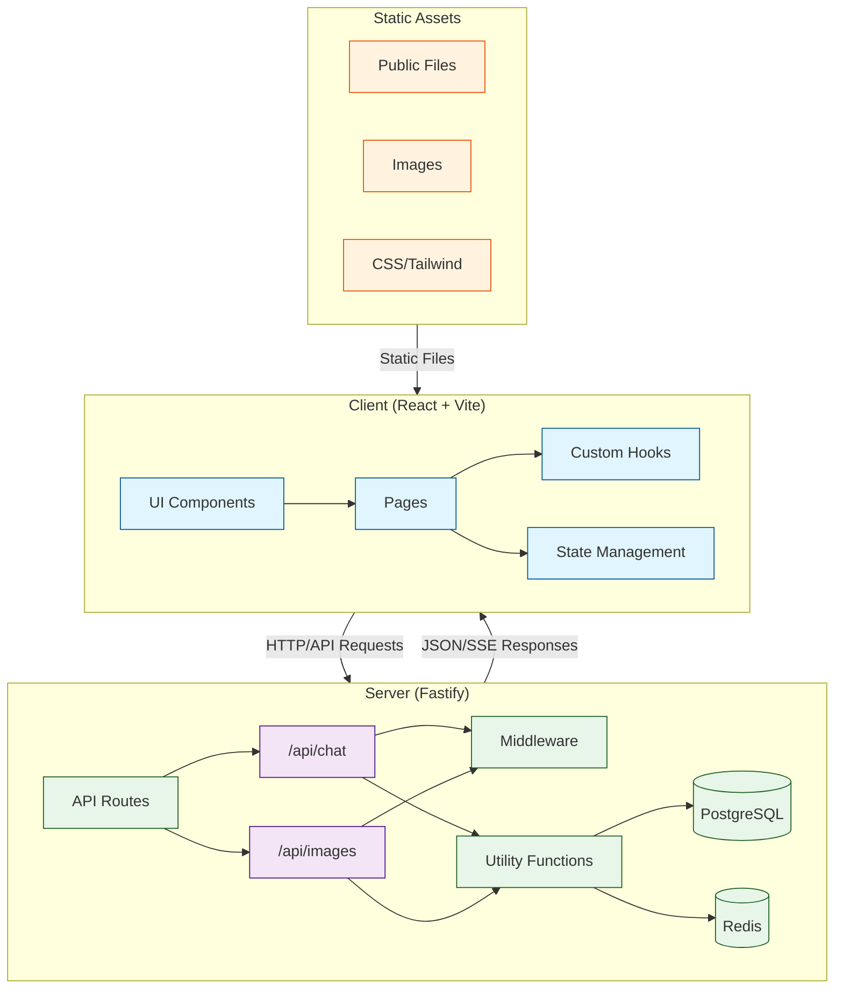

# Project Architecture

This document outlines the architecture and interactions between different components of the
application.

## System Architecture Diagram

## Component Interactions

1. **Client-Side**

   - React components render the UI and manage local state
   - Pages handle routing and layout
   - Custom hooks manage reusable logic and API interactions
   - Tailwind CSS provides styling

2. **Server-Side**

   - Fastify handles HTTP requests and routing
   - Middleware processes authentication and request validation
   - Library utilities manage database and cache interactions
   - PostgreSQL stores persistent data
   - Redis handles caching and session management

3. **Asset Management**
   - Static files served directly
   - Images and other media optimized for delivery
   - Styles processed through PostCSS/Tailwind

## Data Flow

1. User interacts with React components
2. Components trigger API calls through custom hooks
3. Server receives requests through Fastify routes
4. Middleware validates and processes requests
5. Server performs business logic and database operations
6. Responses flow back to the client
7. UI updates to reflect new data

## Development Workflow

- TypeScript ensures type safety across the stack
- ESM modules for modern JavaScript features
- Environment variables manage configuration
- Vite provides fast development and optimized builds
