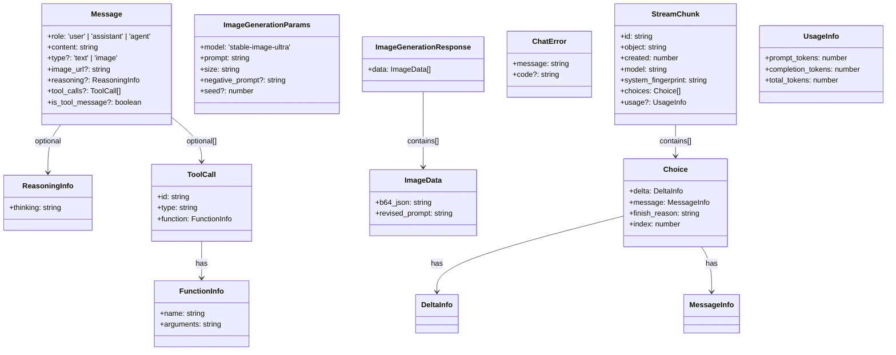
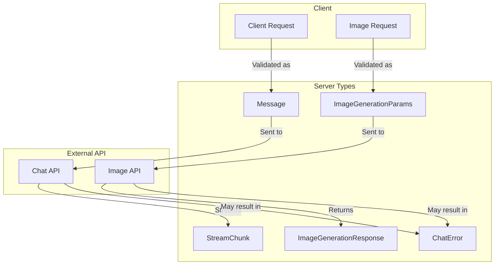

# Type Relationships

This document outlines the relationships between different TypeScript interfaces and types in the
application.

## Server Types Diagram

## Type Usage Flow

## Type Descriptions

1. **Message**

   - Core message type for chat interactions
   - Supports text and image content types
   - Can include reasoning and tool call information

2. **ImageGenerationParams**

   - Parameters for image generation requests
   - Includes prompt, size, and optional settings

3. **ImageGenerationResponse**

   - Response from image generation API
   - Contains base64 encoded image and revised prompt

4. **StreamChunk**

   - Streaming response format for chat
   - Contains incremental updates and usage stats

5. **ChatError**
   - Standardized error response format
   - Used across both chat and image endpoints

## Usage in Routes

The types are used in two main routes:

1. `/api/chat`

   - Handles chat interactions with streaming support
   - Uses Message type for request/response
   - Returns StreamChunk for incremental updates

2. `/api/images`
   - Handles image generation requests
   - Uses ImageGenerationParams for requests
   - Returns ImageGenerationResponse with generated images
